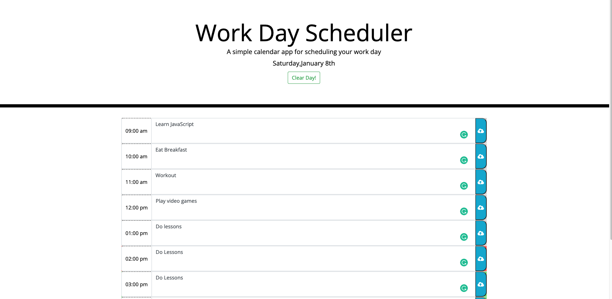

# Password Generator

## Purpose

A tool that allows a user to input their daily schedule and have it show times that are either past, present, or future with corresponding background colors.

## Table of Contents
- [Built With](#built-with)
- [Website](#website)
- [Installation](#installation)
- [Usage](#usage)
- [Contribution](#contribution)
- [License](#license)

## Built With

* HTML
* CSS
* JavaScript

## Website

https://nsvoboda.github.io/nate-workday-scheduler/

### Installation

It is best practice to directly clone the respository by using the following code in your Terminal/Command Line:

git clone git@github.com:nsvoboda/nate-workday-scheduler.git

You can also download the files into a .zip directly from the GitHub repository.

### Usage

Enter your daily schedule into the relevant time blocks in order to help keep yourself organized througout the day.

## Contribution
Edited with ❤️ by Nate.

## License

&copy; 2021 Nathaniel Svoboda

Licensed under the [BSD 2-Clause](LICENSE.txt)